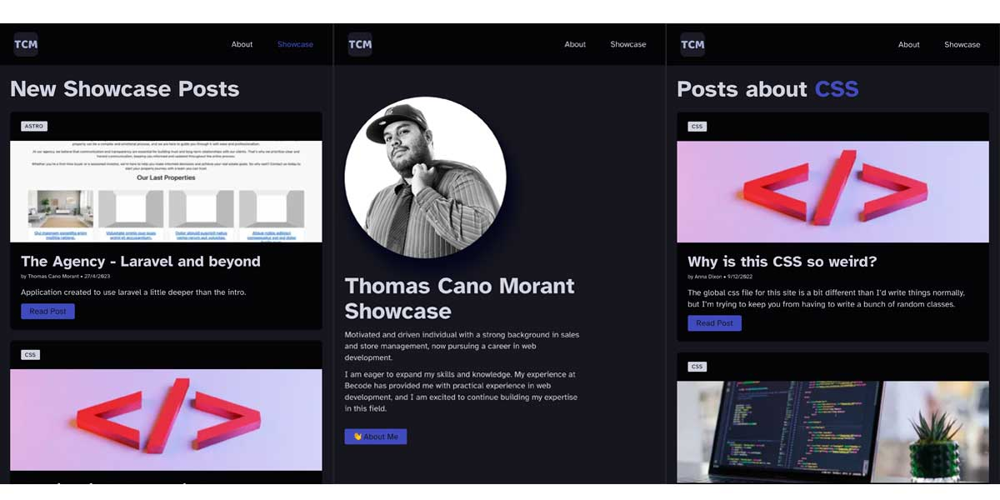

# Thomas Cano Morant Showcase

## About this project
A Web Developer needs a presence online and this project allows me to make one, instead of making a basic site, i chose to make a project with [Astro](https://astro.build/), which allows me to update easily the site afterwards. 

# Why astro
[Astro](https://astro.build/) is a new technology I wanted to learn, the main advantage of it:
 - it makes the route by itself, 
 - works with components,
 - allows to work with the commons framework and libraries,
 - allows some dynamic pagination,

# what still to do
- write a better readme to explain in depth the site.